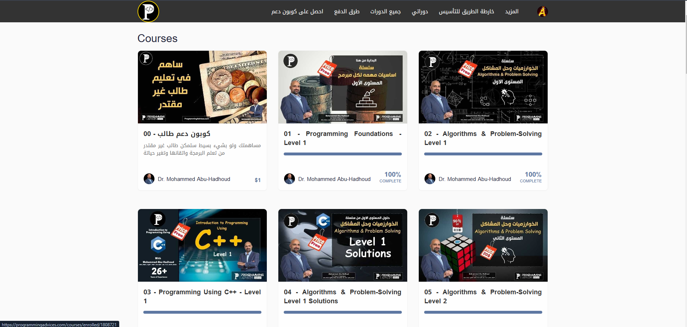
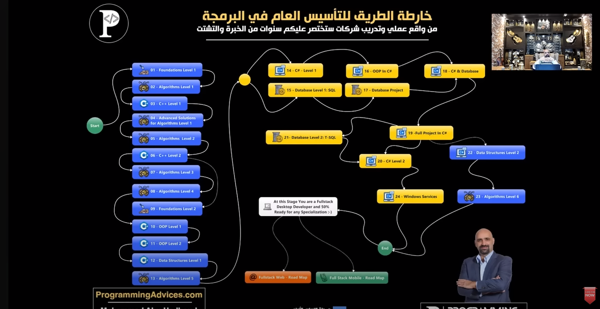

# Basic Roadmap Repository

[Access courses]([https://lnkd.in/e3eyfZ5M](https://programmingadvices.com/courses)) ✨

 Welcome to my Basic Roadmap Repository, where I’m documenting my programming journey and progress through a carefully designed course roadmap. This repository is a comprehensive resource for my learning journey, inspired and guided by Mohammed Abu-Hadhoud, a mentor with over 27 years of programming experience.

## Roadmap Overview

This roadmap is structured around 24 carefully curated courses covering foundational and advanced programming topics, each designed to build a well-rounded skill set. Key topics include:

1. **C++ Basics**: Starting with core programming concepts and syntax.
2. **Object-Oriented Programming (OOP)**: Learning about classes, objects, and advanced OOP principles.
3. **C# Fundamentals**: Exploring the basics and nuances of C#.
4. **.NET Framework**: Diving into .NET to understand its architecture and applications.

*...and many more courses that support my journey to becoming a skilled developer.*

## Purpose

The purpose of this repository is to serve as a structured record of my growth as a developer, showcasing code, projects, and practical applications for each course. Here, you’ll find hands-on projects that align with each topic, helping to reinforce the concepts learned and apply them in real-world scenarios.

## Follow Along

I'm documenting my learning journey on LinkedIn, sharing updates, key insights, and takeaways from each course. This repository will be continuously updated to reflect my progress and provide valuable resources for others interested in programming and problem-solving.
